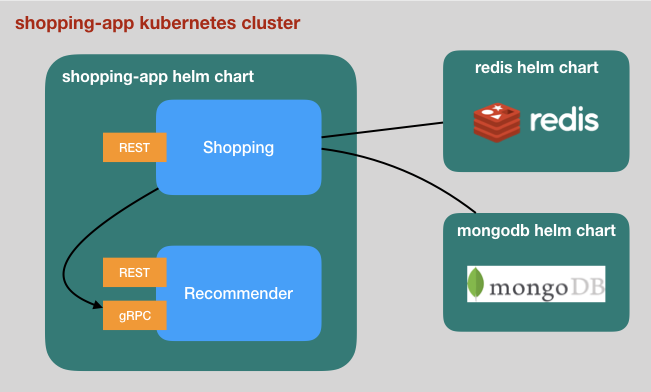

# Kubernetes based deployment

The shopping example application consists of multiple microservices that are
deployed as Docker containers managed by a kubernetes cluster.

This directory contains the script and helm chart for the shopping application.

## Helm chart

The chart is described in `shopping-app`.



As illustrated above, the chart includes two deployments and corresponding
services:

- shopping (exposing REST endpoints)
- recommender (exposing REST and gRPC endpoints)

The chart depends on two other charts for the databases:

- [mongodb](https://github.com/helm/charts/tree/master/stable/mongodb)
- [redis](https://github.com/helm/charts/tree/master/stable/redis)

## Try it out

### Prerequisites

- [Docker](https://www.docker.com/)
- [Kubernetes](https://kubernetes.io/)
- [Minikube](https://github.com/kubernetes/minikube)
- [Helm](https://helm.sh/)

### Run the demo

```
cd loopback4-example-shopping
npm i
npm run build
./kubernetes/create-k8s.sh
```
